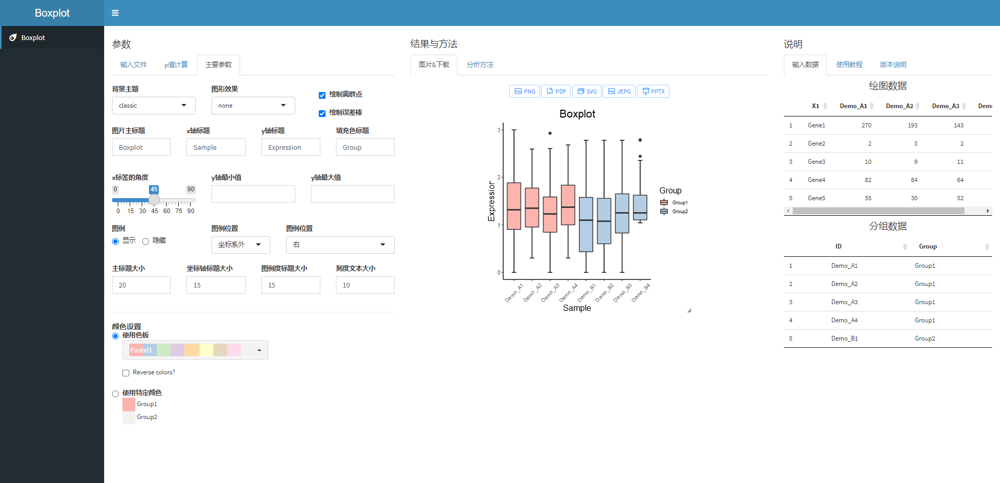

### Boxplot shiny APP



本shiny工具主要用于绘制boxplot图片及添加比较组的显著性p值等信息。

主要依赖如下：

```R
> sessionInfo()
R version 4.1.2 (2021-11-01)
Platform: x86_64-w64-mingw32/x64 (64-bit)
Running under: Windows 10 x64 (build 22000)

Matrix products: default

locale:
[1] LC_COLLATE=Chinese (Simplified)_China.936 
[2] LC_CTYPE=Chinese (Simplified)_China.936   
[3] LC_MONETARY=Chinese (Simplified)_China.936
[4] LC_NUMERIC=C                              
[5] LC_TIME=Chinese (Simplified)_China.936    

attached base packages:
[1] stats     graphics  grDevices utils     datasets  methods  
[7] base     

other attached packages:
 [1] htmltools_0.5.2      datamods_1.2.0      
 [3] shinyWidgets_0.6.4   shinythemes_1.2.0   
 [5] shinydashboard_0.7.2 shiny_1.7.1         
 [7] shinyjqui_0.4.1      DT_0.21             
 [9] readxl_1.3.1         readr_2.1.2         
[11] tidyr_1.2.0          purrr_0.3.4         
[13] stringr_1.4.0        magrittr_2.0.2      
[15] tibble_3.1.6         dplyr_1.0.8         
[17] ggsignif_0.6.3       ggplot2_3.3.5       
[19] RColorBrewer_1.1-2   officer_0.4.2       
[21] rvg_0.2.5            rlang_1.0.1         
[23] esquisse_1.1.0      

loaded via a namespace (and not attached):
 [1] sass_0.4.0          jsonlite_1.8.0      carData_3.0-5      
 [4] bslib_0.3.1         assertthat_0.2.1    cellranger_1.1.0   
 [7] gdtools_0.2.4       pillar_1.7.0        backports_1.4.1    
[10] glue_1.6.1          uuid_1.0-4          digest_0.6.29      
[13] promises_1.2.0.1    colorspace_2.0-3    httpuv_1.6.5       
[16] pkgconfig_2.0.3     broom_0.7.12        haven_2.4.3        
[19] xtable_1.8-4        scales_1.1.1        fontawesome_0.2.2  
[22] phosphoricons_0.1.1 openxlsx_4.2.5      later_1.3.0        
[25] rio_0.5.29          tzdb_0.2.0          generics_0.1.2     
[28] car_3.0-12          ellipsis_0.3.2      ggpubr_0.4.0       
[31] withr_2.5.0         cli_3.2.0           crayon_1.5.0       
[34] mime_0.12           fansi_1.0.2         rstatix_0.7.0      
[37] forcats_0.5.1       xml2_1.3.3          foreign_0.8-82     
[40] tools_4.1.2         data.table_1.14.2   hms_1.1.1          
[43] lifecycle_1.0.1     munsell_0.5.0       zip_2.2.0          
[46] compiler_4.1.2      jquerylib_0.1.4     systemfonts_1.0.4  
[49] grid_4.1.2          rstudioapi_0.13     htmlwidgets_1.5.4  
[52] gtable_0.3.0        abind_1.4-5         DBI_1.1.2          
[55] curl_4.3.2          R6_2.5.1            fastmap_1.1.0      
[58] utf8_1.2.2          stringi_1.7.6       Rcpp_1.0.8         
[61] vctrs_0.3.8         tidyselect_1.1.2   
```

